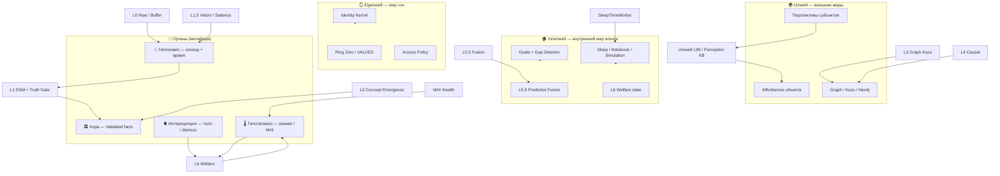

# Органическая память и три «мира»: Umwelt · Innenwelt · Eigenwelt

> **Статус:** концептуальная схема (без реализации)  
> **Дата:** 22.05.2026  
> **Источники:** нейрометафора, `Documents/system` (CognitiveFact, Umwelt L99), `docs/seed/02_polyperspective_seed.md`, `docs/knowledge/KNOWLEDGE_4_PERCEPTION.md`, v4 docx (Innenwelt + predictive coding)

Это **одна страница-карта**: как «отделы» организма, слои L0–L6 Velantrim, Fractal Memory и три немецких понятия из биосемиотики **сходятся** в одну электронную архитектуру.

---

## 1. Три «Welt» — что это (простыми словами)

| Термин | Буквально | В Velantrim / ExoCortex | Эмодзи |
|--------|-----------|------------------------|--------|
| **Umwelt** | «окружающий мир» *как его видит* субъект | Внешние перспективы: воробей, инженер, учёный — **affordances** на один объект | 🌍👁️ |
| **Innenwelt** | «внутренний мир» — знаки, модели, симуляции *внутри* | Состояние агента, цели, предсказания, «что будет если», welfare, блокнот | 🏠🔮 |
| **Eigenwelt** | «собственный мир» — я, идентичность, ценности | Identity, Ring Zero, persona, VALUES_CORE, L6 values | 🪞⚖️ |

**Uexküll (классика):** живое существо живёт не в «объективной вселенной», а в **Umwelt** — среде значимых сигналов.  
**Innenwelt** — внутренняя сеть смыслов, через которую Umwelt *переживается*.  
**Eigenwelt** — граница «я» / «не-я».

В **v4 docx** Innenwelt названа явно: *внутренняя симуляция + предсказательное кодирование* — агент не только реагирует, но **предсказывает** и **проигрывает сценарии**.

В **system docx** акцент на **Umwelt layer = 99** в `CognitiveFact`: параллельные агенты-перспективы (🐘🦅🐙🧬👤🌍).

---

## 2. Схема: органы ↔ слои L0–L6 ↔ три Welt



---

## 3. Таблица: орган → слой → модуль в коде (сегодня)

| 🧬 Орган (метафора) | Слой | Welt | Модуль / API (V8.6) | Статус |
|---------------------|------|------|---------------------|--------|
| 👁️ Сенсорика | L0 | Umwelt ← вход | `raw_memory`, ingest, Telegram (fractal) | 🟢 |
| 🦛 Гиппокамп | L0–L1 | Umwelt + время | bi-temporal, `episode_hash`, Velum co-occur | 🟢 |
| 🏛️ Кора | L1 | Innenwelt ← знание | `memory.py`, ESM, `/facts`, consolidate | 🟢 |
| 🕸️ Ассоциативная сеть | L3 | Umwelt | Kuzu, Etir, causal graph | 🟢 |
| 🌿 Поли-перспектива | **L99** / seed | **Umwelt** | `umwelt_store`, `umwelt_mvp_seed.json`, `/umwelt/*` | 🟢 |
| 🧪 Концепты | L2 | Umwelt → кора | `concept_emergence` (нужен `ENABLE_*`) | 🟡 |
| 🌡️ Гипоталамус | L6 + MHI | **Innenwelt** | `welfare_monitor`, `/health` | 🟡 off |
| 😴 Сон | worker | **Innenwelt** | `sleep_time_worker`, `consolidation_engine` | 🟢 |
| 🔮 Предсказание | L5.5 | **Innenwelt** | `predictive_fusion` (off) | 🟡 |
| 🪞 «Я» | Ring Zero | **Eigenwelt** | `IMMUTABLE_FACT_IDS`, immutable core | 🟡 |
| 🫀 Желудок / тело | — | **Innenwelt** | `somatic_marker` в metadata + welfare | 🟡 |
| 🎯 Намерение | — | **Innenwelt** | `goal_stack`, `/goals`, `/gaps` | 🟢 |
| 🌀 Fractal профиль | L3 fractal | Umwelt (Neo4j) | `Graphiti_fractal/layers/l3_fractal.py` | 🟣 fork |

Легенда: 🟢 работает · 🟡 код есть, выкл. · 📚 только знания · 🔴 идея · 🟣 отдельный репозиторий

---

## 4. Umwelt — глубже (внешние миры)

### 4.1 Что хранить

Один объект **🌳 дерево** — много записей:

| Perceiver | Affordance (что «предлагает» объект) |
|-----------|--------------------------------------|
| 🐦 воробей | сидеть, прятаться, искать насекомых |
| 👤 инженер | материал, конструкция, нагрузка |
| 🔬 учёный | фотосинтез, экосистема |

Это **не противоречия** — параллельные истины в разных Umwelt (см. `02_polyperspective_seed.md`).

### 4.2 Связь с CognitiveFact (system docx)

```text
layer = 0..4   →  факт в «своём» уровне абстракции
layer = 99     →  Umwelt-запись (affordances[], filter_vector, agent_id)
```

Связь в графе: `(Agent)-[:PERCEIVES]->(CognitiveFact)`.

### 4.3 Что уже есть в репо

| Артефакт | Роль |
|----------|------|
| `docs/knowledge/KNOWLEDGE_4_PERCEPTION.md` | формат seed perception.* |
| `docs/seed/02_polyperspective_seed.md` | инварианты + Umwelt по видам |
| `ENABLE_VELUM` + ingest | слабый аналог «наблюдение эпизода» |
| ModeRouter **UMWELT** (v2 docx) | `core/router/`, `response_lens` в `/query` | 🟢 |

---

## 5. Innenwelt — глубже (внутренний мир)

### 5.1 Определение для Velantrim

**Innenwelt** — всё, что агент **несёт внутри себя**, не сводя к «фактам о мире»:

| Компонент Innenwelt | Смысл | Аналог в коде / плане |
|-------------------|--------|----------------------|
| 🔮 **Предсказание** | «что будет дальше» | L5.5 Predictive Fusion, causal hints в query |
| 🎬 **Симуляция** | проигрыш сценариев без действия | Gap Detector + suggest_next_step (Sleep worker) |
| 🎯 **Цели** | зачем помнить | Goal Stack (v2 docx) |
| 😰 **Состояние** | стресс, перегруз, усталость | L6 WelfareMonitor |
| 📓 **Рабочая модель сессии** | «сейчас мы делаем X» | CoreMemoryBlocks, ResearchNotebook |
| 🫀 **Телесные маркеры** | тревога, дискомфорт темы | *новое:* `somatic_marker` в metadata |

**Отличие от Umwelt:** Umwelt = как **мир выглядит снаружи для субъекта X**; Innenwelt = как **агент внутри себя организует опыт и действие**.

### 5.2 Отличие от Eigenwelt

| | Innenwelt | Eigenwelt |
|---|-----------|-----------|
| Меняется | часто (каждая сессия) | медленно (ценности, личность) |
| Пример | «сейчас я в режиме исследования, предвижу риск» | «я Velantrim, Graph=Truth, не вру» |
| Слой | L5.5, L6, Goals, Simulation | Ring Zero, Identity Kernel, L3.5b |

### 5.3 Поток данных (концепт)

```text
Вход (Umwelt) ──► L0/L1 факты
                    │
                    ▼
              Innenwelt обновляет:
              • welfare / MHI
              • goals & gaps
              • predictions (L5.5)
              • notebook (sleep)
                    │
                    ▼
              Query / Action ◄── Eigenwelt (фильтр «кто я»)
```

---

## 6. Eigenwelt — глубже (мир «я»)

| Элемент | Назначение |
|---------|------------|
| `VALUES_CORE`, Ring Zero | неизменяемые аксиомы |
| Identity Kernel (v2) | имя, стиль, роль агента |
| Truth Gate + I50 | «я не переписываю Validated молча» |
| Access Policy | что кому видно в памяти |

**Эмодзи-правило:** Eigenwelt **мало** и **жёстко**; Innenwelt **много** и **гибко**.

---

## 7. Три новых блока (не L7 — поперечные контуры)

Предлагаемые **контуры**, не обязательно новые номера слоёв:

| ID | Название | Welt | Задача |
|----|----------|------|--------|
| **H** | HippoBridge 🦛 | Umwelt↔L1 | Склейка эпизода: время, контекст, fact_ids, episode_hash |
| **I** | InteroceptionBus 🫀 | Innenwelt | somatic_marker, distress → salience, welfare |
| **P** | PolyWeltRegistry 🌍 | Umwelt | Реестр perceiver + affordances (из seed → runtime) |

Они **надстраиваются** над L0–L6, не заменяют их.

---

## 8. Fractal Memory (Graphiti fork) — место на карте

```text
Graphiti_fractal:
  L0 = conversation_buffer     (не raw_memory V8.6)
  L1 = Graphiti episodic       (Neo4j)
  L2 = communities + concept_emergence
  L3 fractal = LLM-профиль сущности (layers/l3_fractal.py)
```

**Использовать вместе:** V8.6 = тело + факты + Kuzu + Innenwelt-воркеры; Fractal = **верхняя абстракция Umwelt** при поднятом Neo4j.

---

## 9. Рекомендуемый порядок (только мышление → потом код)

| Фаза | Фокус | Welt | Эмодзи |
|------|-------|------|--------|
| A | Episode bundle + consolidate | Umwelt + L1 | 🦛🟢 |
| B | Goals + Gap MVP | Innenwelt | 🎯 |
| C | Welfare on + somatic tags | Innenwelt + 🫀 | 🌡️ |
| D | Umwelt MVP: engineer + scientist lenses | Umwelt | 👁️ |
| E | Perception seed → graph edges | Umwelt | 📚→🕸️ |
| F | CognitiveFact v9 | все три Welt | 🧬 |
| G | Fractal L3 profile (опц.) | Umwelt | 🌀 |

---

## 10. Одна фраза

**Umwelt** — многие внешние правды об одном мире 🌍  
**Innenwelt** — внутренняя модель, предсказание и состояние агента 🏠  
**Eigenwelt** — кто я и что мне нельзя нарушать 🪞  

Velantrim **уже закрывает** гиппокамп-кору-граф 🟢; **следующая глубина** — formalize **три Welt** поверх L0–L6, а не ещё один SQLite.

---

## Связанные документы

| Документ | Тема |
|----------|------|
| [LAYERS_AND_HORIZONS.ru.md](LAYERS_AND_HORIZONS.ru.md) | Официальная карта L0–L6 |
| [ROADMAP_FROM_SYSTEM.ru.md](ROADMAP_FROM_SYSTEM.ru.md) | Спринты из system docx |
| [docs/seed/02_polyperspective_seed.md](seed/02_polyperspective_seed.md) | Umwelt seed |
| [docs/knowledge/KNOWLEDGE_4_PERCEPTION.md](knowledge/KNOWLEDGE_4_PERCEPTION.md) | Perception KB |
| [VISION_V10_DRAFT.md](VISION_V10_DRAFT.md) | CognitiveFact |
| [RELATED_PROJECTS.ru.md](RELATED_PROJECTS.ru.md) | V8.6 vs Graphiti |
