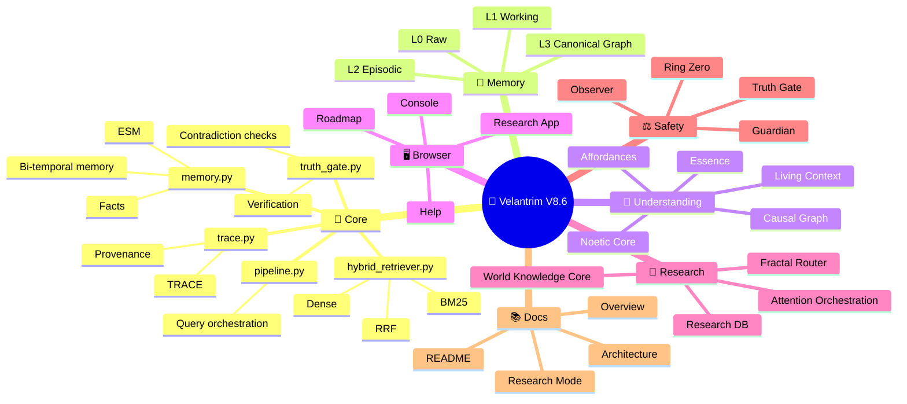

# 🔱 Velantrim ExoCortex — System Architecture

**Language:** English  
**Russian source:** [`VELANTRIM_ARCHITECTURE.md`](VELANTRIM_ARCHITECTURE.md)  
**Purpose:** visual English companion architecture document.

---

## 🧭 Contents

1. [🎯 What Velantrim Is](#1--what-velantrim-is)
2. [🌟 Project Philosophy](#2--project-philosophy)
3. [🗺️ Full System Map — MindMap](#3-%EF%B8%8F-full-system-map--mindmap)
4. [🏗️ Architectural Layers](#4-%EF%B8%8F-architectural-layers)
5. [🧠 Core Modules](#5--core-modules)
6. [📁 Input Layer — File Parsers](#6--input-layer--file-parsers)
7. [🎨 Output Layer — File Generators](#7--output-layer--file-generators)
8. [🧬 Understanding Layer](#8--understanding-layer)
9. [🌐 HTTP API](#9--http-api)
10. [🧪 Tests And Quality](#10--tests-and-quality)
11. [🔭 Research Horizons](#11--research-horizons)
12. [🔱 Why It Is Different](#12--why-it-is-different)

---

## 1. 🎯 What Velantrim Is

Velantrim is an **ExoCortex**: an external memory and reasoning system for AI agents and human work.

It is designed to solve a core problem of ordinary LLMs:

> LLMs can speak fluently, but they do not own reliable memory, evidence, or truth.

Velantrim gives the AI:

| Capability | How |
|---|---|
| 🧠 Stores facts | SQLite / graph / L0-L3 memory |
| 🔍 Finds knowledge | BM25, dense retrieval, graph paths, metadata |
| ⚖️ Checks truth | ESM, Truth Gate, contradiction checks |
| 🧾 Shows trace | provenance, source, route, facts used |
| 🧬 Understands structure | causal graph, living context, affordances |
| 🖥️ Works in browser | FastAPI + browser console |
| 🧪 Experiments safely | separate Research Mode memory |

### Analogy

```text
LLM alone:
  fluent speaker

Velantrim + LLM:
  speaker + memory + librarian + fact-checker + map + audit trail
```

---

## 2. 🌟 Project Philosophy

The project is built on a simple but strict rule:

```text
The LLM may speak.
The graph must hold truth.
The trace must show why.
```

### Principles

| Principle | Meaning |
|---|---|
| 🧠 Memory before fluency | Do not rely only on generated text |
| ⚖️ Truth before confidence | A confident answer is not automatically true |
| 🧾 Trace before trust | If the route is invisible, trust is weak |
| 🌌 Layers before chaos | Raw, working, episodic, and canonical memory are different |
| 🧪 Research without damage | Experimental features must not corrupt stable memory |

### What Velantrim Does Not Claim

Velantrim does not claim to be conscious, magical, or a new Transformer architecture.

It is better described as:

> an explainable external cognitive orchestration layer over LLMs, retrieval, memory, and a graph truth store.

---

## 3. 🗺️ Full System Map — MindMap

### ASCII MindMap

```text
🔱 VELANTRIM_ExoCortex_V8.6/        ← project root
│
│  ┌─── INPUT DATA ────────────────────────────────────────────────┐
│  │  Any file, text, API event, note, chat, or external source    │
│  │  PDF · DOCX · PPTX · MP3 · MP4 · EPUB · ZIP · EML · HTML ... │
│  └───────────────────────────────────────────────────────────────┘
│                           │
│                           ▼
├── 📂 core/                              ← SYSTEM CORE
│   │
│   ├── 📁 file_parsers/    ───────── STAGE 1 ✅  File → Fact
│   │   ├── 🐍 base.py                   ABC + ParserRegistry + _ModelSingleton
│   │   ├── 🐍 file_ingester.py          main orchestrator
│   │   ├── 🐍 pdf_parser.py             Marker → Docling → PyMuPDF
│   │   ├── 🐍 docx_parser.py            Unstructured → python-docx
│   │   ├── 🐍 pptx_parser.py            python-pptx
│   │   ├── 🐍 text_parser.py            TXT / MD / JSON / YAML / code
│   │   ├── 🐍 csv_parser.py             CSV / XLSX / ODS
│   │   ├── 🐍 image_parser.py           OCR + EXIF
│   │   ├── 🐍 audio_parser.py           faster-whisper singleton
│   │   ├── 🐍 video_parser.py           ffmpeg + AudioParser
│   │   ├── 🐍 epub_parser.py            EPUB / MOBI / FB2
│   │   ├── 🐍 email_parser.py           EML / MSG / MBOX
│   │   ├── 🐍 html_parser.py            trafilatura → BS4
│   │   └── 🐍 archive_parser.py         ZIP / TAR / 7Z / RAR + recursion
│   │
│   ├── 🐍 memory.py         ───────── MEMORY (L0 + L1)
│   │   ├── store_fact()                 write fact into memory
│   │   ├── get_fact()                   read fact
│   │   ├── transition_esm()             change epistemic state
│   │   └── get_all_facts()              export with filters
│   │
│   ├── 🐍 pipeline.py       ───────── QUERY ORCHESTRATOR
│   │   └── run(query, mode)             Query → Retrieve → Guard → Answer
│   │
│   ├── 🐍 truth_gate.py     ───────── VERIFICATION
│   │   ├── TruthGate.evaluate()         check a fact
│   │   └── ContradictionRegistry        NLI / contradiction detector
│   │
│   ├── 🐍 mhi.py            ───────── HEALTH MONITOR
│   │   └── MHI = validation + freshness + precision + graph
│   │
│   ├── 🐍 hybrid_retriever.py ─────── SEARCH
│   │   └── BM25 + dense embeddings + RRF
│   │
│   ├── 🐍 ngram_index.py    ───────── FTS5 PRE-FILTER
│   ├── 🐍 sleep_time_worker.py ─────── BACKGROUND CONSOLIDATION
│   ├── 🐍 embedding_registry.py ────── embedding models
│   ├── 🐍 storage.py        ───────── GraphStore ABC
│   ├── 🐍 trace.py          ───────── W3C PROV-O provenance
│   │
│   ├── 🆕 causal_graph.py   ───────── Patch 13: Causal Graph
│   ├── 🆕 living_context.py ───────── Patch 14: Living Context
│   ├── 🆕 understanding_layer.py ──── Causal + Context + Affordance
│   └── 🆕 affordance_linker.py ────── Variant C MVP
│
│  ┌─── OUTPUT DATA ───────────────────────────────────────────────┐
│  │  Any export format                                            │
│  │  PDF · DOCX · PPTX · XLSX · HTML · EPUB · MD · LaTeX ...     │
│  └───────────────────────────────────────────────────────────────┘
│
├── 🌐 server.py                  FastAPI HTTP server
├── 🖥️ static/console/            browser console
├── 🧪 tests/                     370+ tests
├── 🗃️ migrations/                SQLite migrations
├── 📊 benchmarks/                pipeline benchmarks
├── ⚙️ scripts/                   maintenance / sync scripts
├── 📚 docs/                      documentation
├── 💾 data/                      runtime databases (gitignored)
├── 📄 pyproject.toml             version + dependencies
├── 📄 .env.example               settings template
└── 📄 README.md
```

### Mermaid MindMap



---

## 4. 🏗️ Architectural Layers

```text
┌─────────────────────────────────────────────────────────────────┐
│                        HTTP API Layer                           │
│               FastAPI · REST · Pydantic schemas                 │
└────────────────────────────┬────────────────────────────────────┘
                             │
┌────────────────────────────▼────────────────────────────────────┐
│                    Understanding Layer                          │
│          Causal Graph · Living Context · AffordanceLinker       │
└────────────────────────────┬────────────────────────────────────┘
                             │
┌────────────────────────────▼────────────────────────────────────┐
│                    Pipeline Orchestrator                        │
│      Query → NGram pre-filter → HybridRetriever → TruthGate     │
│                    → Guardian → LLM Answer                      │
└────────────────────────────┬────────────────────────────────────┘
                             │
┌────────────────────────────▼────────────────────────────────────┐
│                        Memory Layer                             │
│          L0 Raw · L1 Working · L2 Episodic · L3 Canonical       │
└────────────────────────────┬────────────────────────────────────┘
                             │
┌────────────────────────────▼────────────────────────────────────┐
│                        Storage Layer                            │
│             SQLite · GraphStore ABC · migrations · data         │
└─────────────────────────────────────────────────────────────────┘
```

---

## 5. 🧠 Core Modules

### ESM — Epistemic State Machine

Tracks the status of knowledge:

```text
Observed → Hypothesized → Supported → Validated → ImmutableCore
              │              │              │
              ▼              ▼              ▼
        Contradicted     Deprecated     Retracted
```

### TruthGate — Verifier

Checks whether a fact or answer is allowed to pass as grounded knowledge.

It should inspect:

- confidence,
- epistemic state,
- source,
- contradiction status,
- risk,
- evidence strength.

### MHI — Memory Health Index

Memory health should not be guessed. It should be measured.

```text
MHI = validation + freshness + precision + graph quality
```

### HybridRetriever — Search

Retrieval combines several search styles:

```text
BM25 / FTS
  + dense embeddings
  + graph relations
  + RRF fusion
  + Facts Pack
```

---

## 6. 📁 Input Layer — File Parsers

The parser layer turns files into memory-ready facts.

Supported input categories:

| Type | Examples |
|---|---|
| Documents | PDF, DOCX, PPTX, EPUB |
| Tables | CSV, XLSX, ODS |
| Text | TXT, MD, JSON, YAML, source code |
| Media | images, audio, video |
| Web / Mail | HTML, EML, MSG, MBOX |
| Archives | ZIP, TAR, 7Z, RAR |

The goal is not only to extract text. The goal is:

```text
file -> parsed content -> metadata -> essence -> fact dict -> memory
```

---

## 7. 🎨 Output Layer — File Generators

Velantrim can also export knowledge into files:

| Output | Use |
|---|---|
| PDF | reports |
| DOCX | readable documents |
| PPTX | presentations |
| XLSX | tables / audits |
| HTML | standalone browser pages |
| Markdown | docs / GitHub |
| EPUB / LaTeX / RST / AsciiDoc | advanced publishing |

This makes the system not only a memory store, but a knowledge production tool.

---

## 8. 🧬 Understanding Layer

The Understanding Layer is where Velantrim moves from stored text toward structured meaning.

### Causal Graph

Relations may include:

```text
causes · prevents · requires · enables
implies · contradicts · generalizes · specializes
precedes · follows · composes · analogous_to
```

### Living Context

Living Context stores dimensions of a situation:

| # | Dimension | Meaning |
|---:|---|---|
| 1 | 🌍 WHERE | place / environment |
| 2 | 👤 WHO | actors |
| 3 | ⚙️ HOW | mechanism |
| 4 | 📦 WHAT | object / topic |
| 5 | 💓 FEEL | affective salience |
| 6 | 🎭 ROLE | role / social frame |
| 7 | ⏳ TIME | time / sequence |
| 8 | 🧠 DEEP | principle / deeper structure |

### Essence + Noetic Orchestration

Future-work and research-mode modules should help the system:

- extract essence,
- detect causal chains,
- identify what matters,
- predict consequences,
- mark uncertainty,
- explain the reasoning path.

Important:

> Noetic or predictive layers must not bypass the Truth Gate.  
> Prediction is not the same as fact.

---

## 9. 🌐 HTTP API

The API layer exposes the ExoCortex to browser tools, agents, and local experiments.

Core endpoint categories:

| Category | Examples |
|---|---|
| Health | `GET /health` |
| Query | `POST /query`, `/ask` style flows |
| Facts | `GET /facts`, `POST /facts` |
| Transitions | `PATCH /facts/{id}/transition` |
| Console | `/console/`, `/console/help`, `/console/roadmap` |
| Research | `/console/research-app`, `/research/query` |
| Layers | `/layers/status`, `/horizons`, `/router/modes` |

Security matters:

- API key should be required for mutation endpoints,
- dev-open mode should be explicit,
- CORS should be restricted by environment,
- browser testing should not silently weaken stable memory.

---

## 10. 🧪 Tests And Quality

Tests protect memory, truth, and architecture.

| Test Group | Purpose |
|---|---|
| ESM | state transitions |
| Truth Gate | validation behavior |
| Pipeline | route from query to answer |
| Hybrid Retriever | search quality |
| Adversarial | edge cases and hostile inputs |
| Server Integration | FastAPI behavior |
| Understanding Layer | causal/context features |
| Affordance MVP | benchmark and Go/No-Go |

Without tests, a memory system slowly becomes a rumor machine.

---

## 11. 🔭 Research Horizons

Research Horizons should document future work without pretending it is already finished.

Useful horizons:

| Horizon | Meaning |
|---|---|
| 🌌 Fractal Memory Router | recursive retrieval through memory levels |
| 🧬 Essence Layer | extract the short human-level meaning |
| 🧠 Noetic Core | essence + causality + prediction + uncertainty |
| 📚 World Knowledge Core | science, logic, quality, time, negative knowledge |
| 🛡️ Adversarial Reasoning | system challenges its own answer |
| 🔗 Cross-Domain Bridges | structural analogies between domains |
| ⏳ Temporal Epistemology | knowledge changes across time/paradigms |

Rule:

> Research is allowed to be ambitious.  
> Documentation must still be honest.

No fake benchmarks, no "first in the world" claims, no untested superiority claims.

---

## 12. 🔱 Why It Is Different

| Normal LLM | Velantrim ExoCortex |
|---|---|
| answers from context | answers from memory + evidence |
| may hallucinate confidently | marks uncertainty and blocks weak claims |
| context disappears | memory persists |
| truth is hidden in weights | truth is explicit in graph/facts |
| no audit route | TRACE shows the route |
| flat retrieval | layered memory + graph paths |
| one conversation at a time | stable and research modes can coexist |

Final formula:

```text
Velantrim = Graph Truth Store
          + Fractal Memory
          + Hybrid Retrieval
          + Facts Pack
          + Truth Gate
          + TRACE
          + Guardian / Observer
          + Browser Console
          + Research Mode
          + LLM / BAE Interface
```

In one sentence:

> Velantrim does not try to make the LLM magically truthful.  
> It builds a system around the LLM where truth can be stored, checked, traced, and explained.

---

## 13. 🧩 Full Detail Mirror From Russian Architecture

The Russian architecture document is more detailed than a normal overview. This section keeps the English companion closer to the original by carrying over the operational details that were missing from the shorter English version.

---

## 14. 🔄 Full Data Cycle

```text
📥 INPUT                         💾 STORAGE                  📤 OUTPUT
──────                          ──────────                  ──────

any file                         ESM lifecycle               any format
PDF / DOCX / MP3...              8 states                    PDF / DOCX / HTML...
       │                              │                           ▲
       ▼                              ▼                           │
FileIngester                    store_fact()               GenerationSpec
       │                              │                           │
       ▼                              ▼                           │
ParseResult → to_fact_dict()   TruthGate.evaluate()       FileExporter
                                      │                           │
                              Validated / Rejected         velantrim_reports
                                      │                    report templates
                              HybridRetriever
                              query-time retrieval
```

---

## 15. 🧠 What V8.5/V8.6 Actually Does

| Capability | Implementation |
|---|---|
| 🧠 Stores facts | `memory.py`, SQLite, L0 cache, ESM lifecycle |
| 🔐 Verifies facts | `truth_gate.py`, confidence, source, evidence, contradiction checks |
| 🔍 Retrieves knowledge | `hybrid_retriever.py`, BM25, dense embeddings, RRF |
| 🧾 Tracks provenance | `trace.py`, W3C PROV-O style trace |
| 🧬 Builds understanding | causal graph, living context, affordances |
| 🧪 Tests architecture | ESM, pipeline, retriever, server, adversarial tests |
| 🖥️ Exposes browser test | FastAPI + static console |
| 🔬 Keeps research separate | Research Mode and horizons docs |

---

## 16. 📁 File Parsers — Detailed Mirror

**Principle:** cascading fallback. Use the best parser when available; fall back safely when dependencies are missing.

| Category | Formats | Primary / Preferred Tool |
|---|---|---|
| 📄 Documents | PDF, DOCX, PPTX, ODT | Marker → Docling → PyMuPDF |
| 📚 Books | EPUB, MOBI, FB2, AZW | ebooklib |
| 📝 Text / Code | TXT, MD, JSON, YAML, TOML, Python, JS | native |
| 📊 Tables | CSV, XLSX, ODS | pandas + openpyxl |
| 📧 Email | EML, MSG, MBOX | email stdlib + extract-msg |
| 🌐 Web | HTML, XHTML, XML | trafilatura |
| 🖼️ Images | JPG, PNG, WebP, HEIC, TIFF | pytesseract + EXIF |
| 🎤 Audio | MP3, WAV, FLAC, M4A, OPUS | faster-whisper |
| 🎬 Video | MP4, MKV, MOV, AVI | ffmpeg → AudioParser |
| 📦 Archives | ZIP, TAR, 7Z, RAR | recursive traversal |

### Key Improvements

- 🆙 PyPDF2 → PyMuPDF: much faster PDF extraction.
- 🆕 Marker as preferred PDF parser when available.
- 🆙 openai-whisper → faster-whisper: faster and lower RAM.
- 🔧 Lazy singleton loading: heavy models load once per process.
- 🔧 SHA256 instead of BLAKE3: fewer external dependencies.
- 🔧 MAX_FILE_SIZE guard: protects against huge files and OOM.
- 🔧 ParserRegistry: adding a format should be small and local.

### ParseResult Shape

```python
ParseResult:
  file_path          # source path
  file_type          # detected file type
  extracted_text     # full extracted text
  metadata           # file metadata
  structured_data    # tables, slides, layout data
  essence            # extracted essence if available
  confidence         # parser confidence
  word_count         # extracted words
  page_count         # pages for PDF/PPTX
  language           # detected language
  warnings           # partial extraction, parser fallback, etc.
  provenance         # W3C PROV-O style provenance

  to_fact_dict()     # converts to store_fact() format
```

---

## 17. 🎨 File Generators — Detailed Mirror

**Principle:** mirror of parsers. Facts become `GenerationSpec`, then a formatted file.

| Format | Library | Features |
|---|---|---|
| 📄 PDF | ReportLab | header/footer, tables, callouts, FactCard |
| 📝 DOCX | python-docx | themes, colored tables, review-ready docs |
| 🎯 PPTX | python-pptx | 16:9 slides, speaker notes |
| 📊 XLSX | openpyxl | multi-sheet, conditional formatting by confidence |
| 🌐 HTML | native | standalone, inline CSS, responsive, print-friendly |
| 📋 Markdown | native | GitHub-flavored, YAML frontmatter |
| 🔄 Other | pypandoc | EPUB, LaTeX, RST, AsciiDoc |

### 5 Visual Themes

| Theme | Palette | Use |
|---|---|---|
| `clean` | blue + slate | default / universal |
| `scientific` | deep blue + serif | academic documents |
| `business` | slate + orange | corporate reports |
| `dark` | cyan + violet on dark | presentations |
| `velantrim` 🔱 | cyan + indigo + pink | internal Velantrim reports |

### 10 Content Blocks

```text
HeadingBlock    — headings h1-h6
ParagraphBlock  — normal / bold / italic / callout paragraph
ListBlock       — ordered / unordered list
TableBlock      — table with caption
CodeBlock       — highlighted code block
ImageBlock      — image with caption
CalloutBlock    — info / success / warning / danger
QuoteBlock      — quote with author
DividerBlock    — horizontal separator
FactBlock 🔱    — Velantrim block: claim + confidence + state + source
```

---

## 18. 🧬 Understanding Layer — Detailed Patch 13/14

This is the transition from memory to understanding.

```text
Memory:
  "A tree grows in the forest."

Understanding:
  tree
    → gives shade
    → enables nesting
    → produces oxygen
    → can become wood
    → affects soil and water
```

### Essence Layer

The Essence Layer should not repeat all retrieved facts. It should compress them into:

```text
many facts / terms / sources
  -> EssenceExtractor: main idea
  -> MeaningRoleTagger: cause / mechanism / effect / risk
  -> MeaningChainBuilder: A -> B -> C
  -> ShortAnswerComposer: short human answer
  -> WhyTrace: why this essence was selected
```

It does not replace Causal Graph, Truth Gate, or TRACE.

### Attention + Noetic Orchestration

Engineering decision:

```text
Do not build a new Transformer.
Build an external transparent orchestrator over Retrieval, Graph, FactsPack, and TruthGate.
```

```text
GoalFrame
  -> ComputeController
  -> AttentionRouter
  -> FactsPack / TruthGate
  -> NoeticCore
  -> Answer + Trace
```

| Module | Role |
|---|---|
| `core/goal_frame.py` | determines goal, risk, domain, response style |
| `core/attention_router.py` | ranks facts by relevance, trust, graph, salience, risk |
| `core/compute_controller.py` | chooses fast / normal / deep / verify / creative path |
| `core/noetic_core.py` | builds essence, causal chain, predictions as hypotheses, uncertainty |

`NoeticCore` never creates truth by itself. It labels outputs:

```text
fact / inference / prediction / hypothesis / unknown
```

---

## 19. 🔗 Patch 13 — Causal Graph Details

| Relation | Meaning | Example |
|---|---|---|
| `causes` | A causes B | rain → wet ground |
| `prevents` | A blocks B | umbrella → not getting wet |
| `requires` | A is required for B | oxygen → combustion |
| `enables` | A makes B possible | transistor → computer |
| `implies` | A logically implies B | all humans mortal → Socrates mortal |
| `contradicts` | A excludes B | liquid ↔ solid in same state/context |
| `generalizes` | A is broader than B | bird ← sparrow |
| `specializes` | A is a special case of B | sparrow → bird |
| `precedes` | A happens before B | dinner → sleep |
| `follows` | A happens after B | sleep follows evening routine |
| `composes` | A contains B | car → wheel |
| `analogous_to` | structural analogy | atom ↔ solar system as historical analogy |

### `knowledge_status`

```text
known        verified manually or from a trusted source
inferred     inferred automatically
hypothetical proposed, not verified yet
unknown      status unknown
```

### Chain Confidence

```text
A →(0.9)→ B →(0.7)→ C →(0.8)→ D

min_confidence     = 0.7
product_confidence = 0.504
```

`min_confidence` is conservative and useful for critical decisions.  
`product_confidence` is useful for ranking probabilistic chains.

---

## 20. 🌿 Patch 14 — Living Context Details

| # | Dimension | Tree Example |
|---:|---|---|
| 1 | 📍 WHERE | forest, park, garden |
| 2 | 🤝 WHO | birds nest, squirrels store food, humans build |
| 3 | 🛠️ HOW | cut, plant, climb, measure |
| 4 | 📦 WHAT | wood, ash, resin, boards, fruit, seeds |
| 5 | 💚 FEEL | alive, strong, calming |
| 6 | 🌊 ROLE | holds soil, produces oxygen, regulates water |
| 7 | ⏰ TIME | grows for decades or centuries, fruits seasonally |
| 8 | 🧠 DEEP | photosynthesis equation and ecosystem role |

Living Context makes knowledge practical:

```text
not only "what is a tree"
but "where it exists, who uses it, what it enables, what it becomes, and why it matters"
```

---

## 21. 📊 Variant C — MVP Benchmark

Go / No-Go criteria:

| F1 | Action |
|---|---|
| ≥ 0.65 | 🟢 excellent — move to Patch 14b Full |
| 0.50-0.65 | 🟡 good — expand carefully |
| 0.38-0.50 | 🟠 minimum — add stronger morphology / NLP |
| < 0.38 | 🔴 below threshold — need stronger parser / model |

---

## 22. 🌐 HTTP API — Detailed Mirror

Base URL:

```text
http://localhost:8000
```

Swagger UI:

```text
http://localhost:8000/docs
```

### Main Endpoints

| Method | Path | Purpose |
|---|---|---|
| `GET` | `/health` | system status |
| `GET` | `/docs` | Swagger UI |
| `POST` | `/ingest/text` | ingest text into memory |
| `POST` | `/query` | ask the agent |
| `POST` | `/facts` | create fact directly |
| `GET` | `/facts/{id}` | read fact |
| `PATCH` | `/facts/{id}/transition` | change ESM state |
| `GET` | `/agent/notebook` | ResearchNotebook / SleepTimeWorker |

### Export Endpoints

| Method | Path | Result |
|---|---|---|
| `POST` | `/export/facts` | facts → file |
| `POST` | `/export/mhi` | MHI dashboard → PDF/HTML |
| `POST` | `/export/truthgate` | TruthGate audit report |
| `POST` | `/export/knowledge_base` | Validated facts → knowledge book |
| `GET` | `/export/formats` | available formats |
| `GET` | `/export/themes` | available visual themes |

### Security Fixes

- `VELANTRIM_API_KEY` is required unless explicit dev-open mode is enabled.
- `X-Api-Key` should protect mutation endpoints.
- `req.by` in transitions must not be trusted for audit identity.
- `CORS_ORIGINS` should be explicit; wildcard CORS is unsafe with credentials.

---

## 23. 🧪 Quality Metrics And Test Distribution

| Metric | Value / Meaning |
|---|---|
| Total tests | 370+ in the Russian architecture note |
| Coverage | around 87% in that snapshot |
| xfail-strict | 1 honest known limitation |
| Python files | around 80 |
| Code lines | around 16 000 |
| Documentation lines | around 5 000 |

Test groups:

```text
test_causal_graph.py             Patch 13: CRUD, traversal, confidence
test_adversarial.py              security + regression
test_esm.py                      ESM lifecycle
test_sleep_time_worker.py        SleepTimeWorker + CoreMemoryBlocks
test_hybrid_retriever.py         retrieval
test_embedding_registry.py       embeddings
test_pipeline.py                 orchestrator
test_truth_gate.py               verification
test_server_integration.py       FastAPI TestClient
test_understanding_layer.py      Patch 13+14
test_affordance_mvp.py           Variant C + benchmark
```

---

## 24. 📚 Version History

### v8.4.0 — Audit Fix Release

External multi-round audit. Critical bugs closed:

| Bug | Symptom | Fix |
|---|---|---|
| SleepTimeWorker startup | `/agent/*` always 503 | removed wrong `store=` parameter |
| NGram split | pipeline and server read different DBs | `set_global_ngram()` dependency injection |
| async/sync mismatch | coroutine passed into JSON handling | coroutine detection |
| TruthGate false positives | simple claims marked contradiction | opt-in contradiction detector |
| MHI dead constant | degraded threshold unused | wired into recommendations |
| API key optional | server could start open | fail fast without key |
| HybridRetriever per-request | model loaded every query | singleton + dirty flag |

### Stage 1 — File Parsers v2

- Marker as primary PDF parser.
- faster-whisper for audio.
- lazy singleton model loading.
- EPUB / Email / HTML / Archive parsers.
- ParserRegistry instead of hardcoded format routing.

### Stage 2 — File Generators v1

- PDF / DOCX / PPTX / XLSX / HTML / MD / Universal generators.
- 5 themes.
- 10 content block types.
- Velantrim-specific `FactBlock`.

### Stage 3 — Integration Layer

- 5 `SKILL.md` documents.
- 4 report templates: MHI, TruthGate, Knowledge Base, Sprint Review.
- HTTP export endpoints.
- parser and generator tests.

### v8.4.4 — NLI Contradiction Detection

- token-XOR replaced with `cross-encoder/nli-deberta-v3-small`.
- two-tier detector: token pre-filter + NLI.
- test count increased in that snapshot.

### v8.5.0 — Understanding Layer

- `core/causal_graph.py` — 12 relation types.
- `core/living_context.py` — 8 dimensions of practical knowledge.
- `core/understanding_layer.py` — integration.
- `core/affordance_linker.py` — Variant C MVP.
- `migrations/008_add_relations.sql` — SQLite tables.

---

## 25. 🗓️ Roadmap Mirror

```text
✅ v8.4.0    Audit Fix
✅ Stage 1   File Parsers v2
✅ Stage 2   File Generators v1
✅ Stage 3   Integration Layer
✅ v8.4.4    NLI Contradiction Detection
✅ v8.5.0    Understanding Layer

🔜 Patch 1   asyncio.to_thread fix
🔜 Patch 3   FSRS retrieval-based maturation
🔜 Patch 4   real E2E tests without MockLLM
🔜 Patch 5   HaluEval external benchmark
🔜 Patch 6   trusted emergency invalidation
📋 Patch 14b Living Context Full
📋 Sprint 2b real LLM in pipeline
📋 Sprint 2c async/await + aiosqlite
📋 v9.0.0 Understanding Layer production-ready
```

---

## 26. 🔱 Comparison With Other Memory Systems

| Capability | Mem0 | Zep | Letta | Velantrim |
|---|---|---|---|---|
| ESM lifecycle | ❌ | ❌ | ❌ | ✅ 8 states |
| Typed causal relations | ❌ | ❌ | ❌ | ✅ 12 types |
| `knowledge_status` | ❌ | ❌ | ❌ | ✅ known / inferred / hypothetical |
| NLI contradiction | ❌ | partial | ❌ | ✅ DeBERTa cross-encoder |
| Bi-temporal model | ❌ | ❌ | ❌ | ✅ valid_from / valid_to style fields |
| Audit trail | ❌ | ❌ | partial | ✅ |
| File I/O | ❌ | ❌ | ❌ | ✅ parsers + generators |
| Ready reports | ❌ | ❌ | ❌ | ✅ report templates |

Note:

> These claims should be kept honest and updated against public documentation before any grant, paper, or public comparison.
